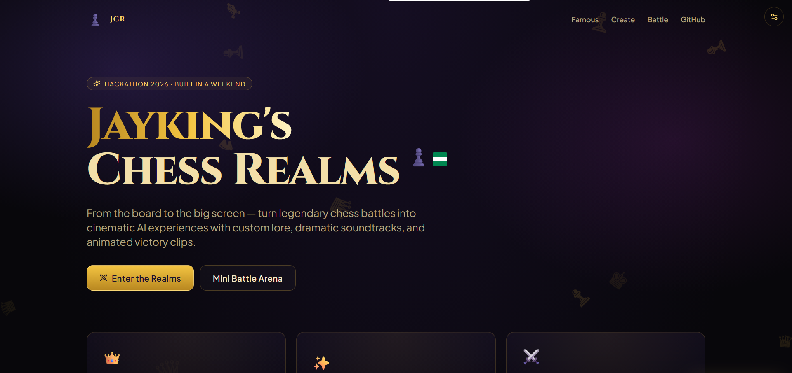

# Jayking's Chess Realms ♟️

> **From the board to the big screen  powered by Quadcode AI**

A cinematic chess lore explorer built for the **Quadcode AI Hackathon 2026**. Pick a legendary chess game and instantly get an epic movie-script story, a custom-themed board, a procedurally composed orchestral soundtrack, and a 15-second cinematic replay video  all generated in your browser.



---

## ✨ What it does

- **🏛️ Famous Legends Library** — 4 pre-loaded masterpieces with verified PGNs:
  - The Immortal Game (Anderssen vs Kieseritzky, 1851)
  - Kasparov vs Deep Blue, Game 6 (1997)
  - The Game of the Century (Byrne vs Fischer, 1956)
  - **The Jayking Special** 🇳🇬 — a dramatic Légal-style smothered mate
- **♟️ Paste Any PGN** — drop in a game from your phone, watch it become legend
- **🎬 Cinematic Lore** — 300–400 word movie-script story generated for every game
- **💬 Live AI Commentary** — every move gets a one-liner ("The bishop seals the trap…")
- **🎨 4 Board Realms** — Royal Nigerian, Cyberpunk, Fantasy, Classic — each with custom piece styles
- **🎵 60-Second Procedural Soundtrack** — tense strings, deep drums, bell climax (Tone.js, fully synthesized in-browser)
- **📽️ 15-Second Cinematic Video** — slow-motion gameplay with camera shake, scanlines, victory burst — exports as `.webm`
- **⚔️ Mini Battle Mode** — play against a random-move AI from any position
- **🎯 Share to X** — pre-filled hype tweet with `#QuadcodeHackathon`

## 🧠 Bring Your Own Key (Optional)

Out of the box, every feature works using **hand-crafted bundled writing** and **procedural generation**. For *live* AI lore + commentary, click the **⚙️ settings icon** (top-right) and paste an [quadcode API key](https://quadcode.ai/). It's stored only in your browser's `localStorage`.

The app calls the Anthropic Messages API directly from the browser using the `anthropic-dangerous-direct-browser-access` header. Use a key with spend limits.

---

## 🚀 Quick Start

### Local

```bash
npm install
npm run dev
```

Opens at `http://localhost:5173`.

### Production Build

```bash
npm run build
npm run preview
```

### Deploy to Vercel (one-click)

```bash
# install Vercel CLI if needed
npm i -g vercel

# from project root
vercel --prod
```

Or just push to GitHub and import the repo at [vercel.com/new](https://vercel.com/new). **No environment variables required** — everything runs client-side. The included `vercel.json` handles SPA routing.

---

## 🛠️ Tech Stack

| Layer | Tool |
|---|---|
| Framework | Vite + React 18 + TypeScript |
| Styling | Tailwind CSS 3, Framer Motion |
| Icons | Lucide React |
| Chess logic | chess.js |
| Audio | Tone.js (procedural orchestra) |
| Video | Canvas + MediaRecorder (WebM VP9) |
| AI text | Anthropic Messages API (optional) |

## 📁 Folder Structure

```
src/
├── App.tsx                    # Main shell & layout
├── main.tsx                   # React entry
├── index.css                  # Tailwind + custom utilities
├── types.ts                   # Shared TS types
├── data/
│   └── famousGames.ts         # 4 pre-loaded games + PGNs
├── hooks/
│   ├── useChessGame.ts        # Replay state machine + battle mode
│   └── useLocalStorage.ts
├── lib/
│   ├── ai-client.ts           # Anthropic API + bundled fallback writing
│   ├── chess-utils.ts         # PGN parsing helpers
│   ├── commentary-bank.ts     # Procedural commentary corpus
│   ├── music-engine.ts        # Tone.js orchestral generator
│   ├── theme-engine.tsx       # 4 board realms + piece glyphs
│   └── video-engine.ts        # Canvas + MediaRecorder pipeline
└── components/
    ├── Hero.tsx
    ├── ParticleBackground.tsx
    ├── GameSelector.tsx
    ├── ChessBoard.tsx
    ├── GameControls.tsx
    ├── CommentaryFeed.tsx
    ├── LorePanel.tsx
    ├── ThemeGenerator.tsx
    ├── MusicPlayer.tsx
    ├── VideoGenerator.tsx
    ├── ShareButtons.tsx
    ├── Footer.tsx
    └── BadgeQuadcode.tsx
```

## 🎬 Demo Flow

1. Land on hero → see floating chess pieces drift over an aurora gradient
2. Tap **"The Jayking Special"** quick-card → scrolls into the stage
3. Press **play** → board animates through the smothered-mate combination
4. Hit **Generate Cinematic Lore** → 350-word movie pitch unfolds
5. Switch realms → board becomes a neon cyberpunk grid in one click
6. **Generate Epic Soundtrack** → 60s of cello + strings + bells starts
7. **Generate 15s Cinematic Clip** → renders a downloadable WebM
8. Toggle **Battle Mode** → finish the game yourself against a random-move AI
9. **Post on X** → share your replay link with the hackathon tag

## 🧩 Built for #QuadcodeHackathon

This is a single self-contained SPA — no server, no environment variables, no signups. It runs entirely in the browser and demonstrates how an agentic workspace can stitch together text, design, audio, and video into one cohesive experience.

**Built in Quadcode AI • Jayking ♟️ • #Hackathon2026**
